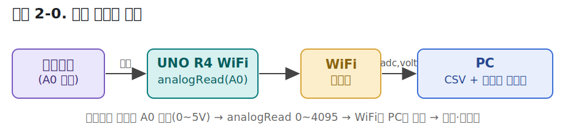
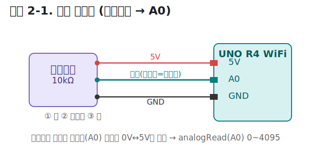
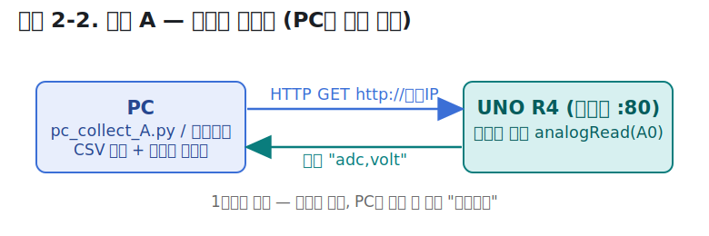
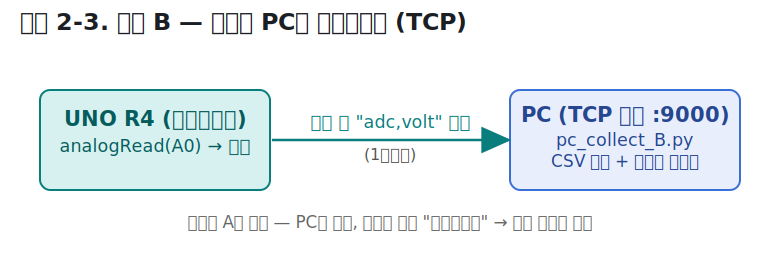
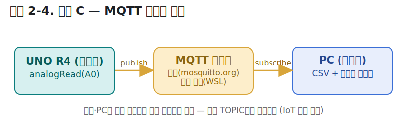
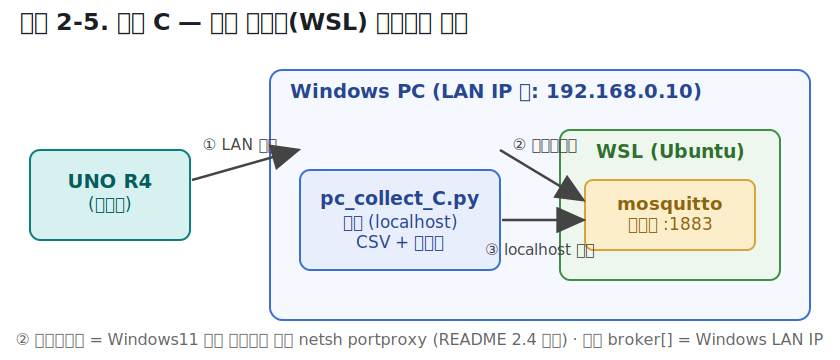
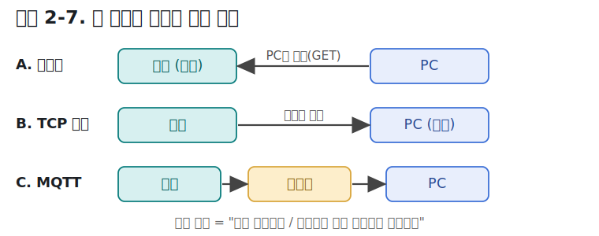
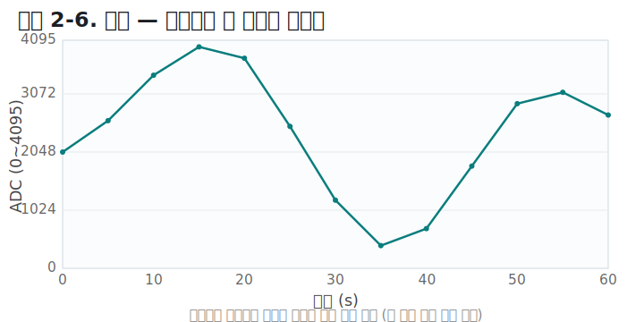

# ARDUINO UNO R4 WiFi

**강의 교재 · 모듈 2 — WiFi로 센서값을 PC에 수집하기**

> 가변저항(A0) 값을 WiFi로 PC에 모으기 · 세 가지 전송 방식(웹서버 · TCP · MQTT)
> CSV 저장 + 실시간 그래프 · 강사용 · 학생용 통합 교재



---

## 목차

- [모듈 1 복습 · WiFi STA 연결](#모듈-1-복습--wifi-sta-연결)
- [모듈 2 · WiFi로 센서값 수집](#모듈-2--wifi로-센서값-수집)
  - [2.0 이 모듈에서 할 일](#20--이-모듈에서-할-일)
  - [2.1 공통 준비 — 회로와 소프트웨어](#21--공통-준비--회로와-소프트웨어)
  - [2.2 방법 A — 보드가 웹서버](#22--방법-a--보드가-웹서버)
  - [2.3 방법 B — 보드가 PC로 밀어보내기(TCP)](#23--방법-b--보드가-pc로-밀어보내기tcp)
  - [2.4 방법 C — MQTT 브로커 경유](#24--방법-c--mqtt-브로커-경유)
  - [2.5 세 방법 비교](#25--세-방법-비교)
  - [2.6 데이터 형식과 결과](#26--데이터-형식과-결과)
  - [2.7 트러블슈팅](#27--트러블슈팅)
  - [2.8 실습 과제](#28--실습-과제)
  - [모듈 2 요약](#모듈-2-요약)

---

# 모듈 1 복습 · WiFi STA 연결

이 모듈은 [WiFi 강의교재 모듈 1](../wifi_강의교재/UNO_R4_WiFi_M0-1_Handout.md)에서 배운 **STA 연결**을 그대로 이어받습니다. 핵심만 짚고 갑니다.

> 🎯 **모듈 1에서 배운 것 (요약)**
> ① `WiFi.begin(ssid, pass)`으로 공유기에 접속  ② `WiFi.status()`가 `WL_CONNECTED`가 될 때까지 폴링  ③ `WiFi.localIP()`로 할당받은 IP 확인  ④ `WiFi.RSSI()`로 신호 세기 확인

세 방법 모두 아래 연결 코드로 시작합니다. **즉시 연결되지 않으므로** 상태를 반복 확인하는 것이 핵심입니다.

```cpp
#include "WiFiS3.h"
#include "arduino_secrets.h"          // SECRET_SSID / SECRET_PASS

void setup() {
  Serial.begin(115200);
  WiFi.begin(SECRET_SSID, SECRET_PASS);
  while (WiFi.status() != WL_CONNECTED) {   // 연결될 때까지 대기
    delay(500);
    Serial.print(".");
  }
  Serial.print("IP: ");
  Serial.println(WiFi.localIP());     // 이후 수집의 접속 주소가 된다
}
```

> 💡 **참고 — 신호 세기(RSSI)**
> 수집이 자꾸 끊기면 `WiFi.RSSI()`로 신호를 확인하세요.

| RSSI 범위 (dBm) | 상태 | 비고 |
|-----------------|------|------|
| -30 ~ -50 | 매우 강함 | 이상적 |
| -50 ~ -67 | 양호 | 안정적 통신 권장 |
| -67 ~ -80 | 약함 | 간헐적 끊김 가능 |
| -80 이하 | 매우 약함 | 연결·통신 곤란 |

> ⚠️ **주의**
> UNO R4 WiFi는 **2.4GHz만** 지원합니다(5GHz 전용 공유기 접속 불가). 또 **보드와 PC는 같은 공유기(같은 네트워크)** 에 있어야 합니다.

---

# 모듈 2 · WiFi로 센서값 수집

## 2.0  이 모듈에서 할 일

모듈 1의 STA 연결 위에, **센서값(가변저항)을 PC로 보내 CSV로 저장하고 실시간 그래프로 보는** 세 가지 방식을 실습합니다. 세 방식은 **센서 읽는 코드는 똑같고, "누가 연결을 시작하고 데이터가 어느 방향으로 흐르는가"만** 다릅니다(그림 2-0 참고).

> 🎯 **학습 목표**
> 이 모듈을 마치면 다음을 할 수 있습니다.
> ① 보드를 웹서버로 만들어 PC가 값을 가져가게 하기 (방법 A)
> ② 보드가 PC 서버로 값을 밀어보내 연속 수집하기 (방법 B)
> ③ MQTT 브로커(공개/로컬)를 거쳐 값을 주고받기 (방법 C)
> ④ 수집한 데이터를 CSV로 저장하고 실시간 그래프로 관찰하기

---

## 2.1  공통 준비 — 회로와 소프트웨어

### 회로 (세 방법 공통)

가변저항(10kΩ 권장) 한 개면 됩니다. 양 끝을 5V·GND에, 가운데(와이퍼)를 **A0**에 연결합니다.



*그림 2-1. 회로 결선도 (가변저항 → A0)*

| 가변저항 핀 | 연결 |
|-------------|------|
| 왼쪽 끝 | 5V |
| 가운데(와이퍼) | **A0** |
| 오른쪽 끝 | GND |

손잡이를 돌리면 A0 전압이 0~5V로 변하고, `analogRead(A0)`가 **0~4095**(12비트)로 읽습니다. (`11_ADC_VR` 예제와 동일한 12-bit·5V 설정)

### 소프트웨어 준비

> 📌 **Arduino IDE**
> - 보드 패키지: *Arduino UNO R4 Boards*
> - 라이브러리: `WiFiS3`(보드 패키지 기본 포함) · `ArduinoMqttClient`(**방법 C만**, 라이브러리 매니저에서 설치)

> 📌 **PC 파이썬** (사용할 방법에 맞춰 설치)
> ```bash
> pip install matplotlib        # 공통(그래프)
> pip install requests          # 방법 A
> # 방법 B는 표준 라이브러리만 사용(추가 설치 없음)
> pip install paho-mqtt         # 방법 C
> ```

### WiFi 접속 정보 입력

각 방법 폴더의 **`arduino_secrets.h`** 에 공유기 정보를 채웁니다.
```cpp
#define SECRET_SSID "우리집공유기"
#define SECRET_PASS "비밀번호1234"
```

---

## 2.2  방법 A — 보드가 웹서버

**보드가 서버, PC가 클라이언트.** PC가 원할 때 `http://보드IP`로 요청하면 보드가 그 순간의 센서값을 응답합니다.



*그림 2-2. 방법 A — 보드가 웹서버 (PC가 값을 당김)*

📂 파일: [`A_webserver/`](A_webserver/) — `A_webserver.ino`, `pc_collect_A.py`

> ✅ **실행 순서**
> 1. `A_webserver.ino` 업로드 → 시리얼 모니터(115200)에서 **보드 IP 확인** (예: `http://192.168.0.50`)
> 2. 브라우저에 그 주소를 쳐서 `adc,volt`가 보이는지 확인 (시연 포인트)
> 3. `pc_collect_A.py`의 `BOARD_URL`을 그 IP로 수정 후 실행
> 4. 가변저항을 돌리며 그래프와 `adc_log_A.csv` 확인

**장점** 브라우저로 즉시 확인 가능(직관적) · **단점** PC가 주기적으로 요청해야 함(주기를 PC가 결정)

---

## 2.3  방법 B — 보드가 PC로 밀어보내기(TCP)

역할이 A와 **반대**입니다. **PC가 서버, 보드가 클라이언트.** 보드가 알아서 계속 값을 밀어보냅니다 → **연속 수집에 가장 적합.**



*그림 2-3. 방법 B — 보드가 PC로 밀어보내기(TCP)*

📂 파일: [`B_tcp_push/`](B_tcp_push/) — `B_tcp_push.ino`, `pc_collect_B.py`

> ✅ **실행 순서**
> 1. PC의 IP 확인 (Windows: `ipconfig` → IPv4 주소, 예 `192.168.0.10`)
> 2. `B_tcp_push.ino`의 `PC_IP`를 그 값으로 수정 후 업로드
> 3. **PC에서 `pc_collect_B.py`를 먼저 실행**(서버 대기) → 그다음 보드가 접속
> 4. 가변저항을 돌리며 그래프와 `adc_log_B.csv` 확인

> 💡 Windows 방화벽이 처음 실행 시 차단을 물으면 **허용**을 눌러야 보드가 접속됩니다.

**장점** 빠르고 연속 수집·저장에 최적 · **단점** PC에 수신 프로그램이 떠 있어야 함

---

## 2.4  방법 C — MQTT 브로커 경유

보드와 PC가 **직접** 연결하지 않고 **중간 브로커**를 거칩니다. 보드는 값을 **발행(publish)**, PC는 **구독(subscribe)** 합니다. 여러 대·원격 확장이 쉬운 IoT 표준 방식입니다.



*그림 2-4. 방법 C — MQTT 브로커 경유*

📂 파일: [`C_mqtt/`](C_mqtt/) — `C_mqtt.ino`, `pc_collect_C.py`

브로커는 **두 가지 방식** 중 하나를 씁니다. 코드에서 주석으로 전환할 수 있게 해두었습니다.

### 방식 ① 공개 테스트 브로커 (설치 불필요)

인터넷만 되면 바로 됩니다. `test.mosquitto.org`(포트 1883)를 사용합니다.

> ✅ **설정**
> - `C_mqtt.ino`: `broker[] = "test.mosquitto.org"` (기본값)
> - `pc_collect_C.py`: `BROKER = "test.mosquitto.org"` (기본값)
> - **`TOPIC`을 고유하게** 바꾸세요. 공개 브로커라 다른 사람과 겹치면 값이 섞입니다.
>   예: `utech/2026a반/adc`

> ⚠️ 공개 브로커는 값이 인터넷으로 나갑니다. 민감한 데이터에는 쓰지 마세요(수업 시연용).

### 방식 ② 로컬 브로커 (WSL + mosquitto)

값을 외부로 보내지 않고 **내 PC 안(WSL)에서** 브로커를 돌립니다. 학교 인터넷이 막혀도 같은 공유기 안이면 됩니다.



*그림 2-5. 방법 C — 로컬 브로커(WSL) 네트워크 구조*

**(1) WSL 설치** — Windows PowerShell(관리자):
```powershell
wsl --install          # Ubuntu 설치 후 재부팅 (이미 있으면 생략)
```

**(2) WSL(Ubuntu)에서 mosquitto 설치·설정:**
```bash
sudo apt update
sudo apt install -y mosquitto mosquitto-clients

# 수업용 최소 설정 파일 만들기 (외부 접속 허용 + 익명 허용)
cat > ~/mosquitto.conf <<'EOF'
listener 1883 0.0.0.0
allow_anonymous true
EOF

# 브로커 실행 (-v: 로그 자세히)
mosquitto -c ~/mosquitto.conf -v
```

**(3) 보드가 WSL 브로커에 닿게 하기** — WSL2는 별도 IP를 쓰므로 아래 둘 중 하나가 필요합니다.

> 📌 **(권장) 미러 네트워킹 — Windows 11**
> `C:\Users\<사용자>\.wslconfig` 파일에:
> ```ini
> [wsl2]
> networkingMode=mirrored
> ```
> 저장 후 PowerShell에서 `wsl --shutdown` → WSL 재시작. 이러면 WSL이 Windows와 **같은 IP**를 공유합니다. 보드는 **Windows PC의 LAN IP**로 접속하면 됩니다.

> 📌 **(대안) 포트 프록시 — Windows 10 등**
> 관리자 PowerShell:
> ```powershell
> wsl hostname -I     # WSL IP 확인 (예: 172.24.10.5)
> netsh interface portproxy add v4tov4 listenport=1883 listenaddress=0.0.0.0 connectport=1883 connectaddress=172.24.10.5
> netsh advfirewall firewall add rule name="MQTT 1883" dir=in action=allow protocol=TCP localport=1883
> ```
> (WSL IP는 재부팅 시 바뀔 수 있으니, 안 되면 `portproxy`를 지우고 새 IP로 다시 추가)

**(4) 코드 설정:**

> ✅ **설정**
> - `C_mqtt.ino`: `broker[]`를 **Windows PC의 LAN IP**(`ipconfig`의 IPv4, 예 `192.168.0.10`)로.
>   → 파일 안의 `[방식 2]` 줄 주석을 풀고 `[방식 1]` 줄을 주석 처리
> - `pc_collect_C.py`: 구독기를 **Windows에서** 실행하면 `BROKER = "localhost"` (WSL 안에서 실행해도 `localhost`)

**연결 확인 (선택)** — WSL에서 직접 구독해 보드값이 오는지 테스트:
```bash
mosquitto_sub -h localhost -t "utech/uno_r4/adc" -v
```

---

## 2.5  세 방법 비교



*그림 2-7. 세 방법의 데이터 방향 비교*

| 구분 | A. 웹서버 | B. TCP 푸시 | C. MQTT |
|------|-----------|-------------|---------|
| 서버 역할 | **보드** | **PC** | 브로커 |
| 연결 시작 | PC가 요청 | 보드가 접속 | 양쪽이 브로커에 접속 |
| 데이터 방향 | PC ◀ 보드 (당김) | 보드 ▶ PC (밀기) | 보드 ▶ 브로커 ▶ PC |
| 인터넷 필요 | ✕ | ✕ | 공개=○ / 로컬(WSL)=✕ |
| 연속 수집 적합도 | ★★ | ★★★ | ★★★ |
| 확장성(여러 기기) | ★ | ★★ | ★★★ |
| 난이도 | 쉬움 | 보통 | 보통~높음 |
| 추가 라이브러리 | 없음 | 없음 | ArduinoMqttClient / paho-mqtt |

> 💡 **추천 수업 순서:** A(개념·브라우저로 확인) → B(수집의 정석) → C(IoT 확장)

---

## 2.6  데이터 형식과 결과 (세 방법 공통)

- 보드가 보내는 한 줄: `adc,volt`  (예: `2048,2.500`)
- PC가 저장하는 CSV 열: `elapsed_s, adc, volt`

```
elapsed_s,adc,volt
0.00,2048,2.500
1.01,3010,3.674
2.02,512,0.625
```

가변저항을 좌우로 돌리면 PC 그래프가 아래처럼 실시간으로 그려집니다.



*그림 2-6. 예시 — 가변저항 값 실시간 그래프 (세 방법 공통 출력 형태)*

`elapsed_s`는 수집 시작 후 경과 시간(초)입니다. 저장된 CSV는 엑셀로 열어 그래프를 그리거나 분석 과제에 활용할 수 있습니다.

---

## 2.7  트러블슈팅

| 증상 | 원인 / 해결 |
|------|-------------|
| `WiFi.status()`가 계속 대기 | SSID/PASS 오타, 또는 **5GHz 전용** 공유기 (R4는 2.4GHz만) |
| 방법 A·B 접속 안 됨 | 보드와 PC가 **다른 네트워크**, 또는 학교 WiFi의 기기 간 차단(AP isolation) → 핫스팟 또는 방법 C |
| 방법 B 보드 접속 실패 | PC 수집기를 **먼저** 실행했는지, `PC_IP`가 맞는지, **방화벽 허용** 했는지 |
| 방법 C(공개) 값이 섞임 | 다른 사람과 **TOPIC 겹침** → 고유 TOPIC으로 변경 |
| 방법 C(WSL) 보드가 브로커에 못 붙음 | 미러 네트워킹/포트프록시 설정 확인, `broker[]`가 **Windows LAN IP**인지, `mosquitto`가 켜져 있는지 |
| 그래프에 한글이 깨짐 | matplotlib 기본 폰트에 한글이 없어서 정상. 축 라벨은 영어로 작성됨(문제 없음) |
| ADC가 0/4095에 붙음 | 가변저항 배선 확인(와이퍼가 A0인지), 5V/GND 반대 연결 여부 |

---

## 2.8  실습 과제

> 🚀 **도전 과제**
> 1. **수집 주기 바꾸기** — 보드의 `delay(1000)`을 100ms로 줄이면 그래프가 어떻게 달라지나?
> 2. **단위 환산** — CSV의 `volt`를 온도/조도 등 실제 센서 단위로 바꿔 저장
> 3. **여러 값 보내기** — `adc,volt` 뒤에 두 번째 센서를 붙여 확장
> 4. **방법 비교 실험** — 같은 조작을 세 방법으로 각각 수집해 CSV 비교(지연/누락 관찰)
> 5. **(방법 C 심화)** 스마트폰 MQTT 앱으로 같은 TOPIC을 구독해 보드값을 휴대폰에서 보기

---

## 모듈 2 요약

- 센서 읽는 코드는 셋 다 동일 — **전송 방식(누가 서버냐 / 데이터 방향)** 만 다르다
- **A 웹서버**: 보드=서버, PC가 당김 → 브라우저로 즉시 확인
- **B TCP 푸시**: PC=서버, 보드가 밀기 → 연속 수집의 정석
- **C MQTT**: 브로커 경유 → **공개(test.mosquitto.org)** 또는 **로컬(WSL+mosquitto)** 선택, 확장에 유리
- 세 방법 모두 `adc,volt` → PC에서 **CSV 저장 + 실시간 그래프**

---

## 폴더 구조

```
18_wifi_sensor_collect/
├── README.md                 ← (이 파일) 강의용 종합 자료
├── images/                   블록도·그래프(SVG) 8개
├── A_webserver/
│   ├── A_webserver.ino       보드: 웹서버
│   ├── arduino_secrets.h     WiFi 접속 정보(채워넣기)
│   └── pc_collect_A.py       PC: HTTP 수집 + CSV + 그래프
├── B_tcp_push/
│   ├── B_tcp_push.ino        보드: TCP 클라이언트(→PC)
│   ├── arduino_secrets.h
│   └── pc_collect_B.py       PC: TCP 서버 + CSV + 그래프
└── C_mqtt/
    ├── C_mqtt.ino            보드: MQTT publisher (공개/로컬 브로커)
    ├── arduino_secrets.h
    └── pc_collect_C.py       PC: MQTT subscriber + CSV + 그래프
```
