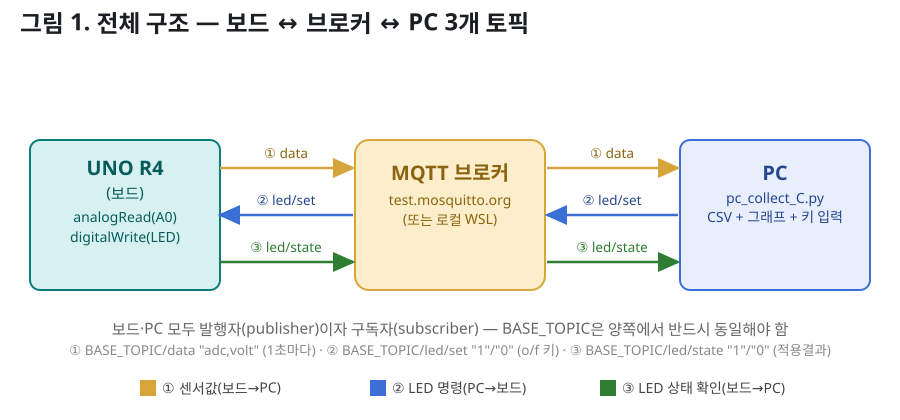
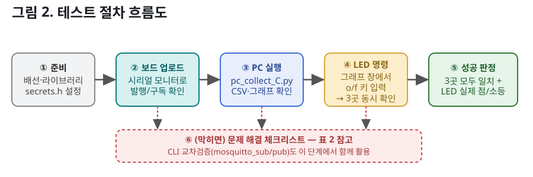
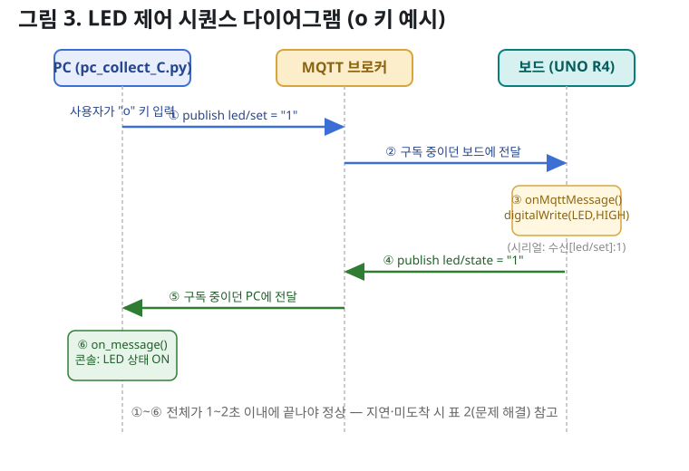
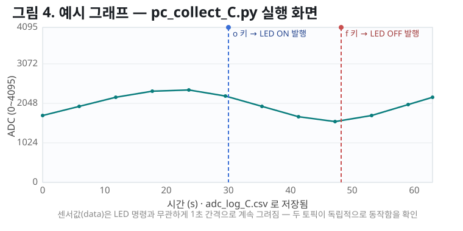

# 01. C_mqtt 양방향(발행/구독) 테스트 가이드

> 대상 파일: [`C_mqtt.ino`](../18_wifi_sensor_collect/C_mqtt/C_mqtt.ino) · [`pc_collect_C.py`](../18_wifi_sensor_collect/C_mqtt/pc_collect_C.py)
> 배선은 기존 가변저항 배선과 동일합니다 → [그림 2-1. 배선도](../18_wifi_sensor_collect/images/fig2-1_wiring.svg)

## 그림 1. 전체 구조



## 표 1. 토픽 요약

| # | 방향 | 토픽 | 페이로드 | 주기 |
|---|---|---|---|---|
| ① | 보드 → PC | `BASE_TOPIC/data` | `adc,volt` 예: `2048,2.500` | 1초마다 |
| ② | PC → 보드 | `BASE_TOPIC/led/set` | `1`(ON) / `0`(OFF) | `o`/`f` 키 입력 시 |
| ③ | 보드 → PC | `BASE_TOPIC/led/state` | `1`(ON) / `0`(OFF) | ②를 처리한 직후 |

> `BASE_TOPIC` 기본값은 `ict2026/uno_r4/mhlee` — **보드 스케치와 PC 스크립트에서 반드시 동일**해야 하며, 겹침 방지를 위해 고유 문자열로 바꾸는 걸 권장합니다.

## 그림 2. 테스트 절차 흐름도



| 단계 | 확인 위치 | 기대 결과 |
|---|---|---|
| ① 준비 | 배선 / `arduino_secrets.h` / `BASE_TOPIC` | 보드-PC 양쪽 `BASE_TOPIC` 일치 |
| ② 보드 업로드 | 시리얼 모니터(115200) | `MQTT 브로커 연결... 성공` → `발행[data]:...` 반복 |
| ③ PC 실행 | 터미널 + 그래프 창 | `구독: .../data / .../led/state` 후 그래프 실시간 갱신 |
| ④ LED 명령 | 그래프 창 포커스 후 `o`/`f` 키 | 아래 [그림 3] 6단계가 1~2초 내 모두 관찰됨 |
| ⑤ 성공 판정 | 파이썬 콘솔·보드 시리얼·실제 LED | 3곳 모두 상태 일치 |

## 그림 3. LED 제어 시퀀스 (o 키 입력 예시)



**④에서 동시에 확인해야 하는 3곳**

| 위치 | 확인 문구 |
|---|---|
| 파이썬 콘솔 | `발행[led/set]: 1 (ON)` |
| 보드 시리얼 모니터 | `수신[led/set]: 1` → `발행[led/state]: 1` |
| 파이썬 콘솔(직후) | `LED 상태(보드 확인): ON` + 실제 LED 점등 |

`f` 키는 값만 반대(`0`/OFF)로 동일하게 확인합니다.

## 그림 4. 실행 화면 예시 그래프



## (선택) CLI 교차 검증

```bash
# 구독: 보드가 발행하는 data / led/state 를 실시간으로 확인
mosquitto_sub -h test.mosquitto.org -t "ict2026/uno_r4/mhlee/#" -v

# 발행: 파이썬 없이 LED만 단독 테스트
mosquitto_pub -h test.mosquitto.org -t "ict2026/uno_r4/mhlee/led/set" -m "1"
```

## 표 2. 문제 해결 체크리스트

| 증상 | 원인 / 조치 |
|---|---|
| 보드가 `WiFi 연결 중.....`에서 멈춤 | SSID/비밀번호 오타, 공유기가 2.4GHz인지 확인 |
| `MQTT 브로커 연결... 실패 rc=...` 반복 | 인터넷 연결 확인, 방화벽의 1883 포트 차단 여부 확인 |
| `o`/`f`를 눌러도 반응 없음 | 그래프 창(matplotlib)에 포커스가 없는 상태 → 창 클릭 후 재시도 |
| 값이 다른 사람 것과 섞여 보임 | `BASE_TOPIC` 겹침 → 보드·PC 양쪽 모두 고유 문자열로 변경 |
| `pip install paho-mqtt` 실패 | `python -m pip install paho-mqtt`로 재시도, Python/pip 경로 확인 |
