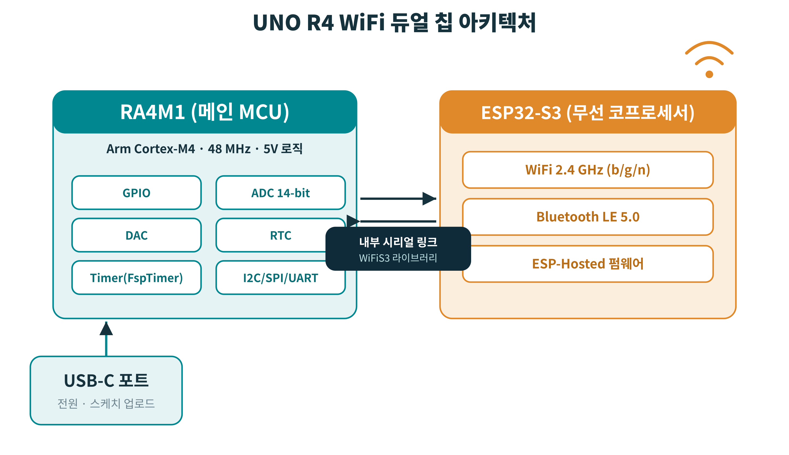
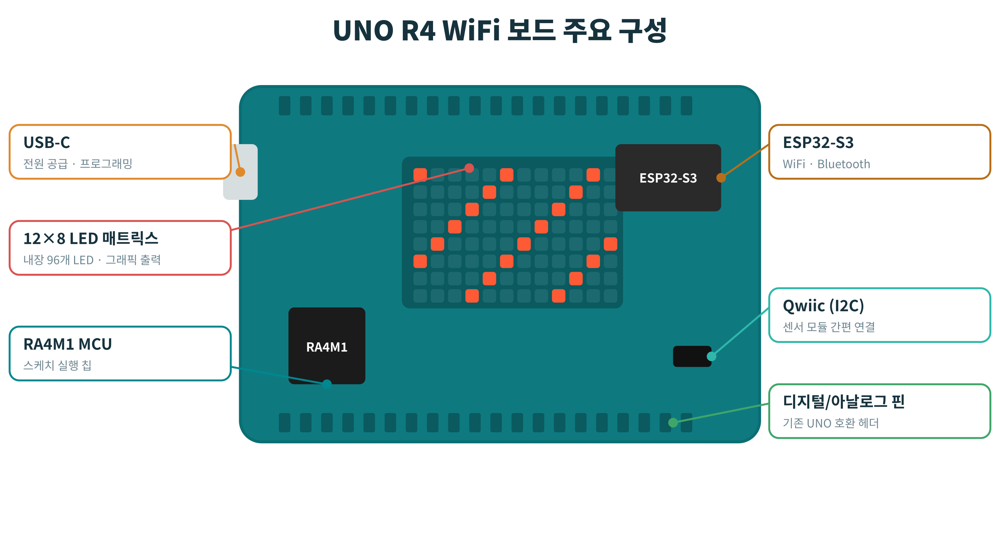
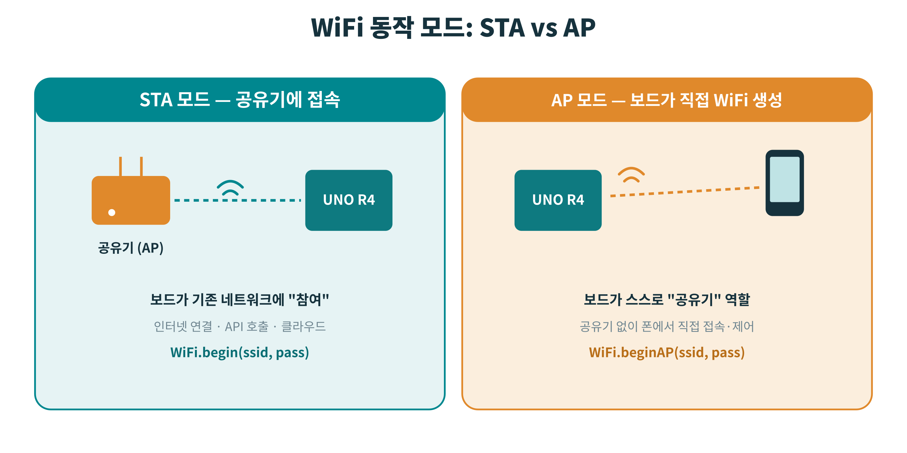
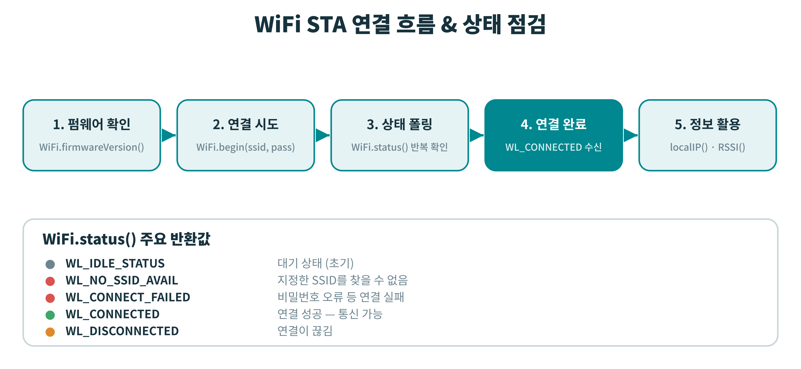

# ARDUINO UNO R4 WiFi

**강의 교재 · 모듈 0–1 — 보드의 이해 & WiFi 연결 기초(STA)**

> RA4M1 + ESP32-S3 듀얼 칩 · 12×8 LED 매트릭스 · 네트워크 연결과 신호 분석
> 강사용 · 학생용 통합 교재

---

## 목차

- [모듈 0 · 보드의 이해](#모듈-0--보드의-이해)
  - [0.1 클래식 UNO(R3)와 무엇이 다른가](#01--클래식-unor3와-무엇이-다른가)
  - [0.2 듀얼 칩 아키텍처](#02--듀얼-칩-아키텍처)
  - [0.3 보드 둘러보기](#03--보드-둘러보기)
  - [0.4 개발환경 4단계 셋업](#04--개발환경-4단계-셋업)
  - [0.5 실습 — 매트릭스에 인사하기](#05--실습--매트릭스에-인사하기)
  - [모듈 0 요약](#모듈-0-요약)
- [모듈 1 · WiFi 연결 기초 (STA)](#모듈-1--wifi-연결-기초-sta)
  - [1.1 WiFi 동작 모드: STA vs AP](#11--wifi-동작-모드-sta-vs-ap)
  - [1.2 연결 흐름과 상태 점검](#12--연결-흐름과-상태-점검)
  - [1.3 핵심 코드 — 연결과 상태 확인](#13--핵심-코드--연결과-상태-확인)
  - [1.4 신호 세기(RSSI) 읽기](#14--신호-세기rssi-읽기)
  - [1.5 실습 — WiFi 스캐너 만들기](#15--실습--wifi-스캐너-만들기)
  - [모듈 1 요약 & 다음 단계](#모듈-1-요약--다음-단계)

---

# 모듈 0 · 보드의 이해

이 모듈에서는 Arduino UNO R4 WiFi가 기존 UNO와 무엇이 다른지, 그리고 보드 위의 두 칩(RA4M1·ESP32-S3)이 각각 어떤 역할을 하는지 이해합니다. 마지막에는 내장 LED 매트릭스로 첫 실습을 진행합니다.

> 🎯 **학습 목표**
> 이 모듈을 마치면 다음을 할 수 있습니다.
> 1. 듀얼 칩 구조와 각 칩의 역할 설명
> 2. R3 → R4의 핵심 변화 구분
> 3. 개발환경 구성과 첫 업로드
> 4. LED 매트릭스 그래픽 출력

---

## 0.1  클래식 UNO(R3)와 무엇이 다른가

가장 큰 변화는 8-bit ATmega328P에서 32-bit Arm Cortex-M4 기반의 **Renesas RA4M1**로 바뀐 점입니다. 클럭은 16MHz → 48MHz로 빨라졌고, 메모리도 크게 늘었습니다. 무엇보다 **WiFi와 Bluetooth가 보드에 내장**되어, 외부 모듈 없이 네트워크 프로젝트가 가능합니다. 단, 로직 전압은 여전히 **5V**라 기존 UNO 쉴드 호환성이 유지됩니다.

| 항목 | UNO R3 | UNO R4 WiFi |
|------|--------|-------------|
| MCU | ATmega328P (8-bit) | RA4M1 (32-bit) + ESP32-S3 |
| 클럭 | 16 MHz | 48 MHz |
| 플래시 / RAM | 32 KB / 2 KB | 256 KB / 32 KB |
| ADC 분해능 | 10-bit | 최대 14-bit + DAC 내장 |
| 무선 | 없음 | WiFi 2.4GHz · Bluetooth LE |
| 특이사항 | 기본 GPIO | 12×8 LED 매트릭스 · Qwiic · RTC |

> 💡 **참고 — 5V 로직의 의미**
> RA4M1 자체는 더 낮은 전압에서도 동작하지만, R4 WiFi는 보드 차원에서 5V 로직 레벨을 유지하도록 설계되어 기존 R3용 쉴드와 센서를 그대로 사용할 수 있습니다. 메모리가 RAM 기준 16배(2KB → 32KB)로 늘어난 덕분에, 네트워크 버퍼나 문자열 처리처럼 메모리를 많이 쓰는 작업도 한결 수월해집니다.

---

## 0.2  듀얼 칩 아키텍처

R4 WiFi에는 두 개의 칩이 협력합니다. **RA4M1**은 여러분의 스케치(`setup`/`loop`)가 실제로 실행되는 메인 MCU이고, **ESP32-S3**는 WiFi·Bluetooth만 전담하는 무선 코프로세서입니다. 우리는 ESP32를 직접 코딩하지 않고, **WiFiS3 라이브러리**를 통해 명령합니다. 이 라이브러리가 두 칩 사이의 내부 시리얼 통신을 대신 처리해 줍니다.



*그림 0-1. UNO R4 WiFi 듀얼 칩 아키텍처*

> 🧩 **역할 정리**
> - **RA4M1 (메인 MCU)** — 내 스케치 코드가 실행되는 곳. 핀 제어, 센서 읽기, 로직 처리.
> - **ESP32-S3 (무선 코프로세서)** — WiFi/BLE 통신 전담. 직접 코딩하지 않음.
> - **WiFiS3 라이브러리** — 두 칩 사이를 잇는 다리. `WiFi.begin()` 같은 호출이 내부적으로 ESP32에 전달됩니다.

---

## 0.3  보드 둘러보기

아래 그림에서 **USB-C 포트**, **12×8 LED 매트릭스**, **Qwiic(I2C) 커넥터**, 그리고 두 칩의 위치를 확인하세요. 매트릭스와 Qwiic은 R4 WiFi에서 새로 추가된 부분으로, 별도 배선 없이 곧바로 실습에 활용할 수 있습니다.



*그림 0-2. 보드 주요 구성 요소*

---

## 0.4  개발환경 4단계 셋업

1. **보드 패키지 설치** — 보드 매니저에서 ‘Arduino UNO R4 Boards’를 설치합니다.
2. **보드 연결** — USB-C 케이블로 연결하고 포트(COM) 인식을 확인합니다.
3. **보드/포트 선택** — 도구 메뉴에서 UNO R4 WiFi와 해당 포트를 지정합니다.
4. **첫 업로드** — Blink 예제를 업로드해 동작을 확인합니다.

> ✅ **확인 포인트**
> 온보드 LED가 깜빡이면 환경 구성 성공입니다. 포트가 보이지 않으면 **데이터 전송이 되는 케이블인지**, **드라이버가 설치되었는지** 먼저 점검하세요.

---

## 0.5  실습 — 매트릭스에 인사하기

새 스케치에 아래 코드를 입력하고 업로드하면, 내장 매트릭스에 ‘HI!’가 왼쪽으로 흐릅니다.

```cpp
#include "ArduinoGraphics.h"
#include "Arduino_LED_Matrix.h"

ArduinoLEDMatrix matrix;

void setup() {
  matrix.begin();
  matrix.beginText(0, 1, 0xFFFFFF);
  matrix.println("HI!");
  matrix.endText(SCROLL_LEFT);
}

void loop() { }   // 글자가 흐릅니다
```

**코드 한 줄씩 보기**

| 구문 | 설명 |
|------|------|
| `#include "ArduinoGraphics.h"` | 텍스트·도형 그리기 기능 제공 |
| `#include "Arduino_LED_Matrix.h"` | 내장 12×8 매트릭스 드라이버 |
| `matrix.begin()` | 매트릭스 초기화 |
| `matrix.beginText(0, 1, 0xFFFFFF)` | 텍스트 시작 좌표(x=0, y=1)와 색상 지정 |
| `matrix.println("HI!")` | 출력할 문자열 |
| `matrix.endText(SCROLL_LEFT)` | 텍스트를 왼쪽으로 스크롤하며 마무리 |

> 🚀 **도전 과제**
> `matrix.loadFrame()`을 사용해 직접 만든 8×12 아이콘(예: 하트, 화살표)을 띄워 보세요. 프레임은 비트 배열로 표현합니다.

---

## 모듈 0 요약

- 메인 칩은 **RA4M1**(32-bit Cortex-M4) — 내 코드가 실행되는 곳
- 무선은 **ESP32-S3**가 담당 — **WiFiS3** 라이브러리로 제어
- **12×8 LED 매트릭스**는 배선 없이 그래픽 출력 가능
- 환경 구성은 **패키지 → 연결 → 선택 → 업로드** 4단계

---

# 모듈 1 · WiFi 연결 기초 (STA)

드디어 보드를 네트워크에 연결합니다. 이 모듈에서는 공유기에 접속하는 **STA 모드**를 익히고, 연결 상태 관리 · 신호 세기(RSSI) 분석 · 주변 네트워크 스캔까지 다룹니다.

> 🎯 **학습 목표**
> 1. `WiFi.begin()`으로 공유기에 접속
> 2. `WiFi.status()`로 상태 관리·재시도
> 3. IP · MAC · RSSI 활용
> 4. `scanNetworks()`로 주변 AP 목록 표시

---

## 1.1  WiFi 동작 모드: STA vs AP

WiFi에는 두 가지 기본 모드가 있습니다.

- **STA(Station) 모드** — 보드가 기존 공유기에 ‘참여’하는 방식으로, 인터넷 연결과 API 호출이 가능합니다.
- **AP(Access Point) 모드** — 보드가 스스로 공유기 역할을 해 폰이 직접 접속하는 방식입니다.

이번 모듈은 **STA 모드**를 다루며, AP 모드는 **모듈 3**에서 학습합니다.



*그림 1-1. STA 모드와 AP 모드 비교*

---

## 1.2  연결 흐름과 상태 점검

연결은 **‘시도 → 상태 폴링 → 완료’** 흐름으로 진행됩니다. 핵심은 **즉시 연결되지 않는다**는 점입니다. `WiFi.status()`가 `WL_CONNECTED`를 반환할 때까지 반복 확인하는 **비차단적 사고**가 중요합니다.



*그림 1-2. STA 연결 흐름과 WiFi.status() 반환값*

---

## 1.3  핵심 코드 — 연결과 상태 확인

```cpp
#include "WiFiS3.h"

const char* ssid = "MyWiFi";
const char* pass = "********";

void setup() {
  Serial.begin(115200);
  WiFi.begin(ssid, pass);
  while (WiFi.status() != WL_CONNECTED) {
    delay(500);   // 연결될 때까지 대기
  }
  Serial.print("IP: ");
  Serial.println(WiFi.localIP());
}
```

**핵심 포인트**

- **`status()` 폴링** — 연결될 때까지 반복 확인. 무작정 기다리지 말고 **횟수 제한·재시도**를 넣으면 더 견고합니다.
- **`localIP()`** — 할당받은 IP 주소. 이후 웹서버의 접속 주소가 됩니다.
- **보안 주의** — SSID/비밀번호는 `arduino_secrets.h` 같은 별도 파일로 분리하는 습관을 들이세요.

---

## 1.4  신호 세기(RSSI) 읽기

**RSSI**(Received Signal Strength Indicator)는 신호 세기를 **dBm**으로 나타내며, **항상 음수**입니다. **0에 가까울수록 강한 신호**입니다. `WiFi.RSSI()`로 현재 연결의 세기를 읽을 수 있습니다.

| RSSI 범위 (dBm) | 상태 | 비고 |
|-----------------|------|------|
| -30 ~ -50 | 매우 강함 | 이상적 |
| -50 ~ -67 | 양호 | 안정적 통신 권장 구간 |
| -67 ~ -80 | 약함 | 간헐적 끊김 가능 |
| -80 이하 | 매우 약함 | 연결·통신 곤란 |

---

## 1.5  실습 — WiFi 스캐너 만들기

주변에 어떤 네트워크가 있는지 스캔해 SSID와 신호 세기를 출력해 봅니다.

```cpp
int n = WiFi.scanNetworks();
Serial.print(n);
Serial.println(" 개의 네트워크 발견");

for (int i = 0; i < n; i++) {
  Serial.print(WiFi.SSID(i));
  Serial.print("  ");
  Serial.print(WiFi.RSSI(i));
  Serial.println(" dBm");
}
```

**예상 시리얼 출력**

```text
3 개의 네트워크 발견
MyWiFi      -52 dBm
Office_5G   -71 dBm
Cafe_Free   -85 dBm
```

> 🚀 **확장 미션**
> 스캔 결과에서 가장 강한 AP를 찾아, 그 RSSI를 모듈 0에서 배운 **LED 매트릭스에 막대그래프**로 표시해 보세요. (네트워크 + 그래픽 결합)

---

## 모듈 1 요약 & 다음 단계

- **STA 연결**: `WiFi.begin` → `status` 폴링 → 연결 완료
- `localIP` · `RSSI`로 연결 상태와 품질 파악
- `scanNetworks()`로 주변 AP 목록과 신호 비교
- **다음 모듈 2**에서는 보드가 **웹서버**가 되어 브라우저로 하드웨어를 제어합니다.
